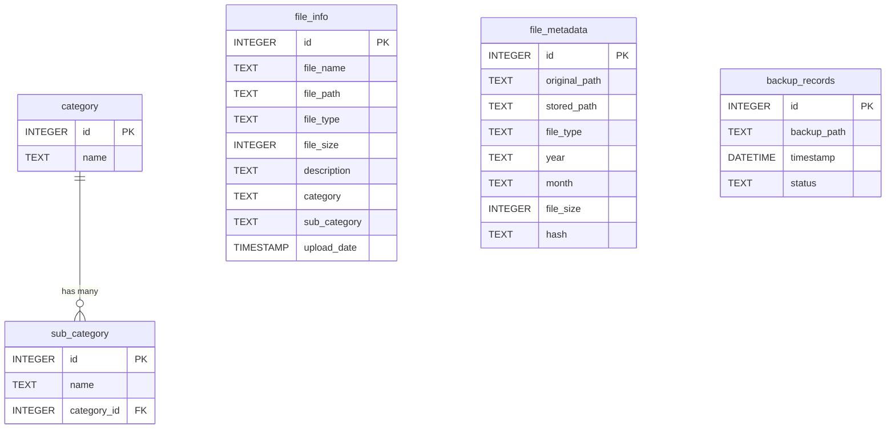

# Relational Database Schema

e-Patra stores relational metadata index logs inside an embedded SQLite database. This document details the database configuration, schema structures, field attributes, and tables managed by Spring Data JPA.

---

## Database Configuration

- **Database Engine:** SQLite 3
- **File Name:** `file_metadata.db`
- **Default Location:** `${user.home}/.e-patra/file_metadata.db`
- **Data Access Layer:** JPA (Hibernate Community Dialect for SQLite)
- **DDL Mode:** `update` (auto-managed mapping schemas)

---

## Schema Architecture & Tables

The SQLite schema consists of five principal tables:

### 1. `file_info`
Stores metadata records for uploaded documents, including custom tag descriptions and classification paths.

| Column Name | SQLite Data Type | Constraints | Description |
| :--- | :--- | :--- | :--- |
| `id` | `INTEGER` | `PRIMARY KEY AUTOINCREMENT` | Auto-incremented unique ID |
| `file_name` | `TEXT` | `NOT NULL` | Original filename on ingestion |
| `file_path` | `TEXT` | `NOT NULL` | Absolute workstation path of source file |
| `file_type` | `TEXT` | `NOT NULL` | MIME Content Type of the document |
| `file_size` | `INTEGER` | `NOT NULL` | Size of the document in bytes |
| `description` | `TEXT` | - | User-input descriptions and searchable tags |
| `category` | `TEXT` | - | Assigned classification category name |
| `sub_category`| `TEXT` | - | Assigned classification subcategory name |
| `upload_date` | `TIMESTAMP` | - | Timestamp of file index entry creation |

### 2. `file_metadata`
Tracks the internal layout of the documents archived inside the local `organized/` file hierarchy.

| Column Name | SQLite Data Type | Constraints | Description |
| :--- | :--- | :--- | :--- |
| `id` | `INTEGER` | `PRIMARY KEY AUTOINCREMENT` | Auto-incremented unique ID |
| `original_path`| `TEXT` | - | Local file source absolute path prior to archive copy |
| `stored_path` | `TEXT` | - | **Relative** path of the file inside the `organized/` folder |
| `file_type` | `TEXT` | - | Extracted lowercase extension |
| `year` | `TEXT` | - | Year directory grouping |
| `month` | `TEXT` | - | Month directory grouping |
| `file_size` | `INTEGER` | - | File size in bytes |
| `hash` | `TEXT` | `UNIQUE` | SHA-256 checksum signature for payload deduplication |

### 3. `category`
Tracks user-defined file taxonomies.

| Column Name | SQLite Data Type | Constraints | Description |
| :--- | :--- | :--- | :--- |
| `id` | `INTEGER` | `PRIMARY KEY AUTOINCREMENT` | Auto-incremented unique ID |
| `name` | `TEXT` | `NOT NULL` | Unique category label |

### 4. `sub_category`
Represents child taxonomies associated with a parent category.

| Column Name | SQLite Data Type | Constraints | Description |
| :--- | :--- | :--- | :--- |
| `id` | `INTEGER` | `PRIMARY KEY AUTOINCREMENT` | Auto-incremented unique ID |
| `name` | `TEXT` | `NOT NULL` | Unique subcategory label |
| `category_id` | `INTEGER` | `NOT NULL`, `FOREIGN KEY REFERENCES category(id)` | Parent category identifier |

### 5. `backup_records`
Logs cold-backup executions run on the workstation.

| Column Name | SQLite Data Type | Constraints | Description |
| :--- | :--- | :--- | :--- |
| `id` | `INTEGER` | `PRIMARY KEY AUTOINCREMENT` | Auto-incremented unique ID |
| `backup_path` | `TEXT` | `NOT NULL` | Destination directory path of the backup folder |
| `timestamp` | `DATETIME` | `NOT NULL` | Execution date and time |
| `status` | `TEXT` | `NOT NULL` | Completion status (`SUCCESS`, `FAILED`, `IN_PROGRESS`) |

---

## Entity Relationships

